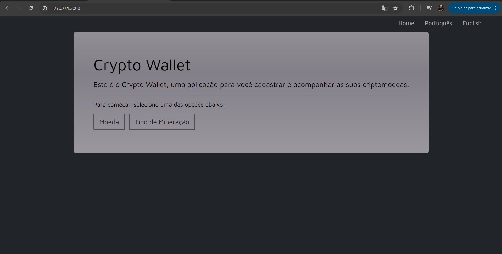
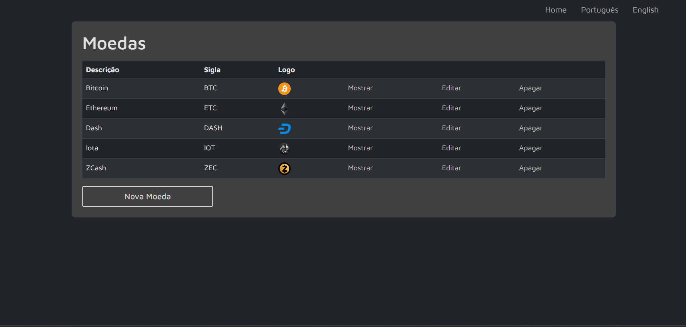
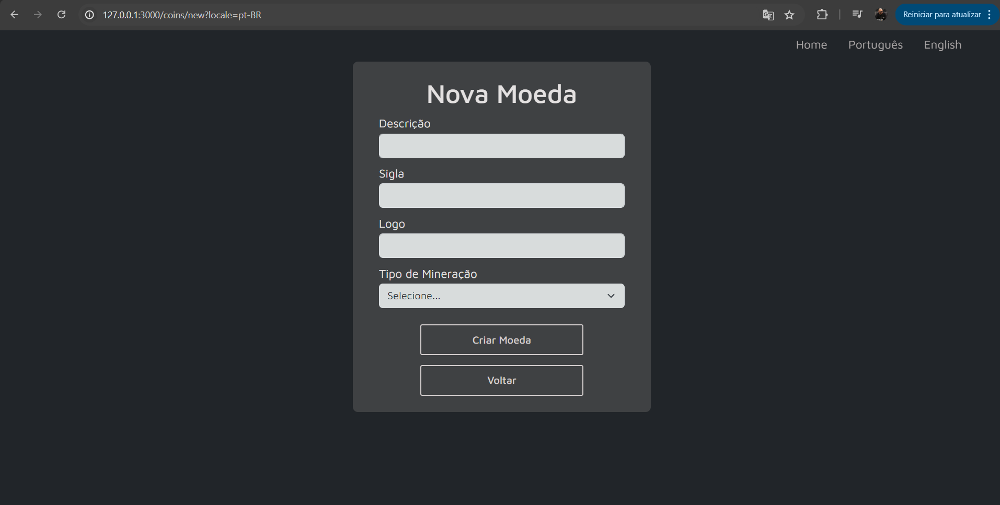
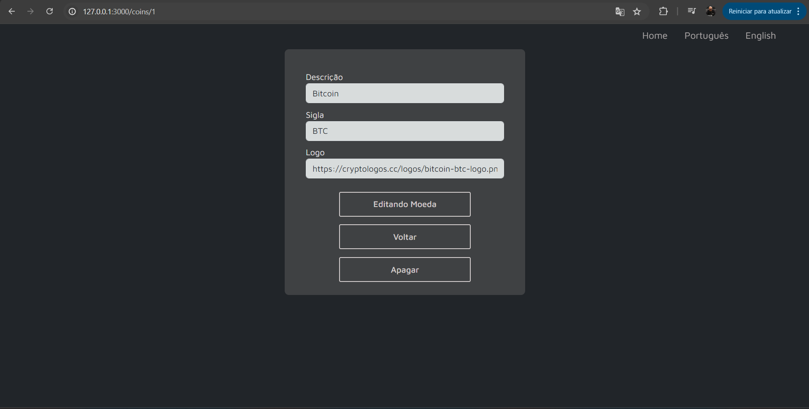
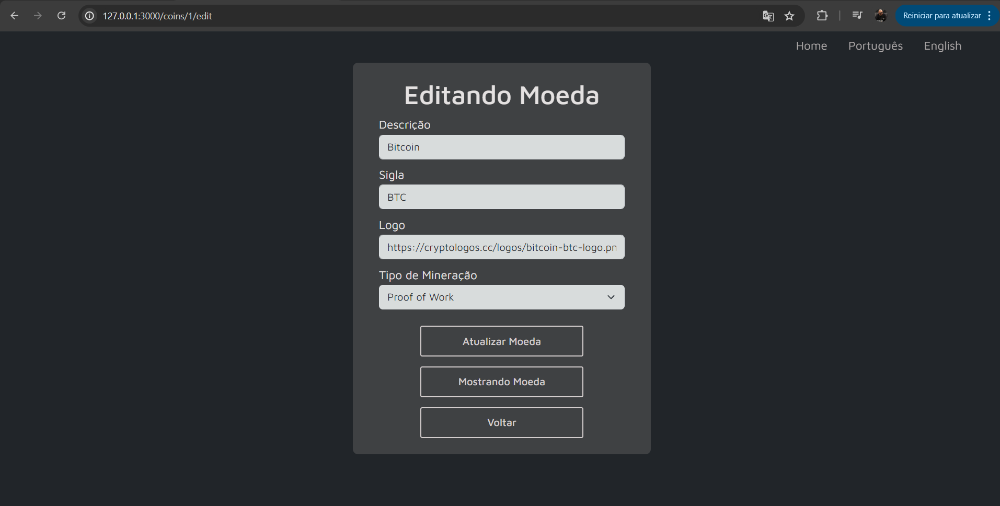
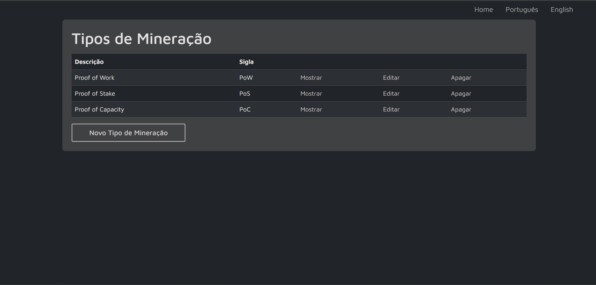
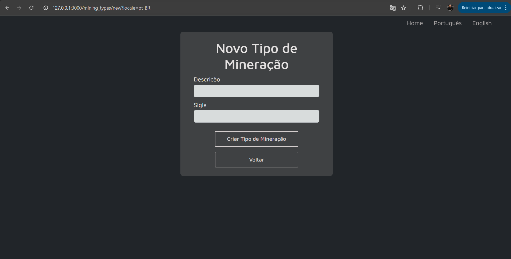

# Crypto Wallet

O Crypto Wallet é uma aplicação para cadastro e acompanhamento de criptomoedas. Ele inclui funcionalidades para gerenciamento de moedas e tipos de mineração, além da opção de alternar entre os idiomas português e inglês.

## Funcionalidades

### Moedas e Tipos de Mineração
Você pode gerenciar moedas e tipos de mineração de forma simples e eficiente, com as seguintes funcionalidades:
* Visualizar tabelas com os itens cadastrados.
* Realizar ações como mostrar, editar ou apagar qualquer registro.
* Criar novos registros utilizando os botões disponíveis no final das tabelas.

## Tecnologias Utilizadas
* Ruby on Rails
* SQLite
* Bootstrap
* SCSS e HTML

## Objetivo do Projeto
Este projeto foi desenvolvido como parte de um curso de Ruby on Rails na Udemy. Ele tem como objetivo ensinar a criar uma aplicação Rails completa, desde a configuração inicial até a integração com um banco de dados.

## Pré-visualização

